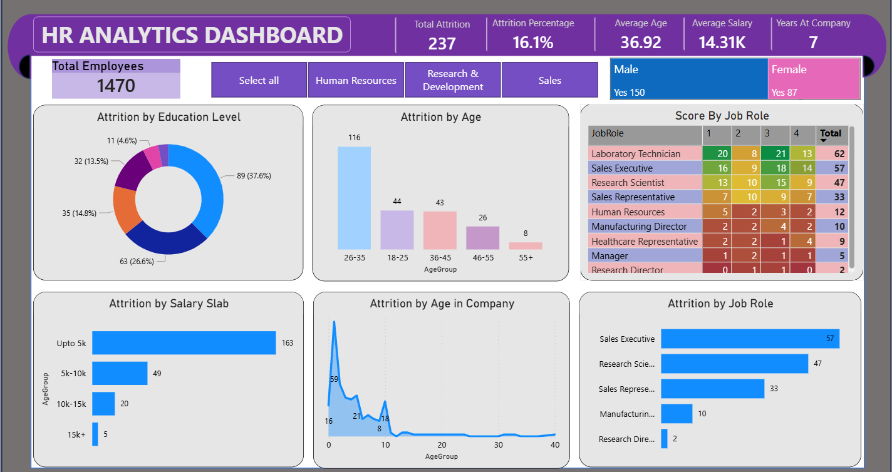

# 📊 HR Workforce Analytics Dashboard (Power BI)

## 📌 Project Overview

Developed an interactive HR analytics dashboard to analyze employee performance, attrition, and workforce trends.

## 🛠 Tools & Technologies

* Power BI
* DAX

## 📊 Key Features

* Employee performance tracking
* Attrition analysis
* Department-wise insights
* KPI monitoring

## 🔍 Key Insights

* Identified factors contributing to employee attrition
* Analyzed workforce distribution across departments
* Improved HR decision-making using data insights

## 📁 Project Structure

* Power BI dashboard (.pbix)
* Screenshots of reports

## 📷 Dashboard Preview

## 🚀 Conclusion

This project showcases data-driven HR analytics and dashboarding skills using Power BI.
